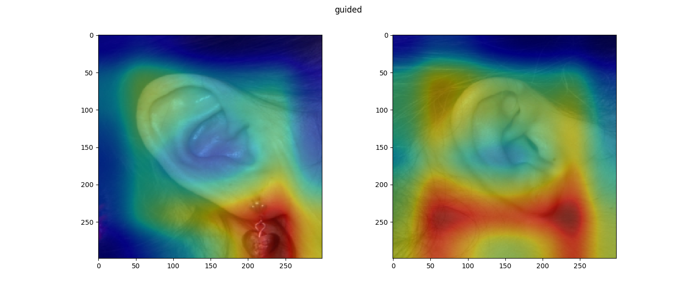
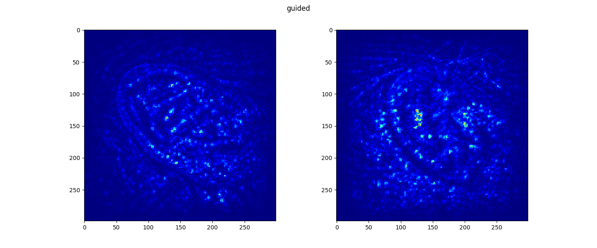

# Biometrics
Biometric identification using pinna scan

<h3>Requirements</h3>
<h4>For insert_mongo.py :</h4>
You need a `config.py` file in the same folder with the mongodb connection string and path to data.

Example `config.py`:
```
connection_string = 'localhost:port/mydb'
ami_img_dir = './dataset'
```
The filenames have to be in the format `integerID_orientation_otherData.jpg`<br/>Eg: `001_left_ami.jpg`

Only the integer ID and orientation is indexed.

<h3>InceptionResNetV2</h3>

`inception.py` generates `inceptionv4_results.npz` which contains two numpy arrays: `classes` and `features`.
- `classes` is a 1D array of length 75 containing the image ids
- `features` is a 2D array of shape (75,1000) containing a (1,1000) length feature vector for each image id.

3 images are processed for each image id.

<h3>Visualising the network</h3>

`visualise_cnn.py` displays a matplotlib visualisation of intermediate layers of the InceptionResNetV2 model for two ear samples.





These files can be found under the `images/` directory.
